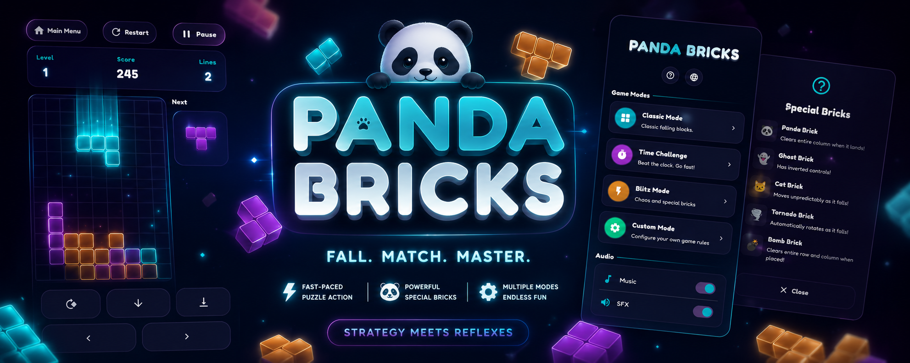

<picture>
  <source media="(prefers-color-scheme: dark)" srcset="assets/images/github/banner.png">
  
</picture>

<p align="center">
  <a href="LICENSE"></a>
  
  
  
</p>

Pandabricks is a modern, panda-themed falling blocks game. Fast, fun, and accessible with smooth animations and multi-language support.

Built by [Team Super Panda](https://www.teamsuperpanda.com).

---

## What it does

Pandabricks takes the classic falling blocks formula and gives it a panda-sized polish pass.

- **Classic gameplay**: familiar falling blocks with a panda twist.
- **Timed mode**: race the clock for high-score bragging rights.
- **Audio & visuals**: background music, SFX, particle effects, animated backgrounds.
- **13+ languages**: English, Arabic, French, Chinese, and more.
- **Dark & light themes**: glass morphism UI that looks good either way.
- **Privacy first**: zero cloud, no accounts, anonymous analytics you can opt out of.

---

## Tech

| Layer | Choice |
|---|---|
| UI | Flutter with Provider |
| State | Provider + ChangeNotifier |
| Storage | Shared Preferences |
| Audio | audioplayers |
| L10n | ARB + flutter gen-l10n |

---

## Run it

```bash
git clone https://github.com/teamsuperpanda/pandabricks.git
cd pandabricks
flutter pub get
flutter run
```

### Tests

```bash
flutter test --coverage
```

---

## License

The code is [PolyForm Noncommercial 1.0.0](LICENSE). Free for personal use, not for resale.
Assets are copyright 2026 Team Super Panda (see [ASSETS-LICENSE.md](ASSETS-LICENSE.md)).
